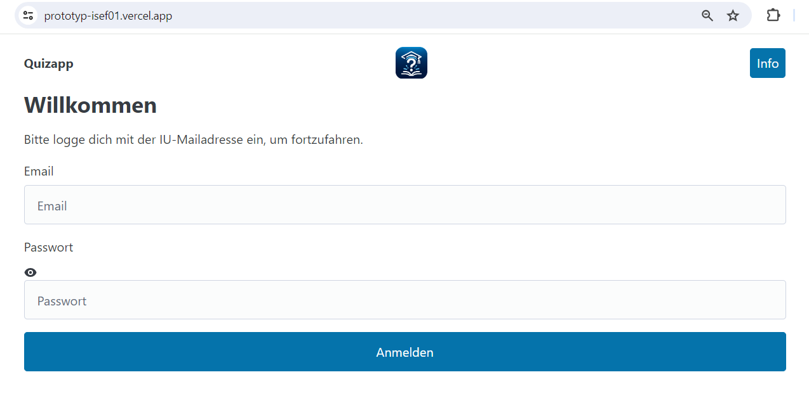
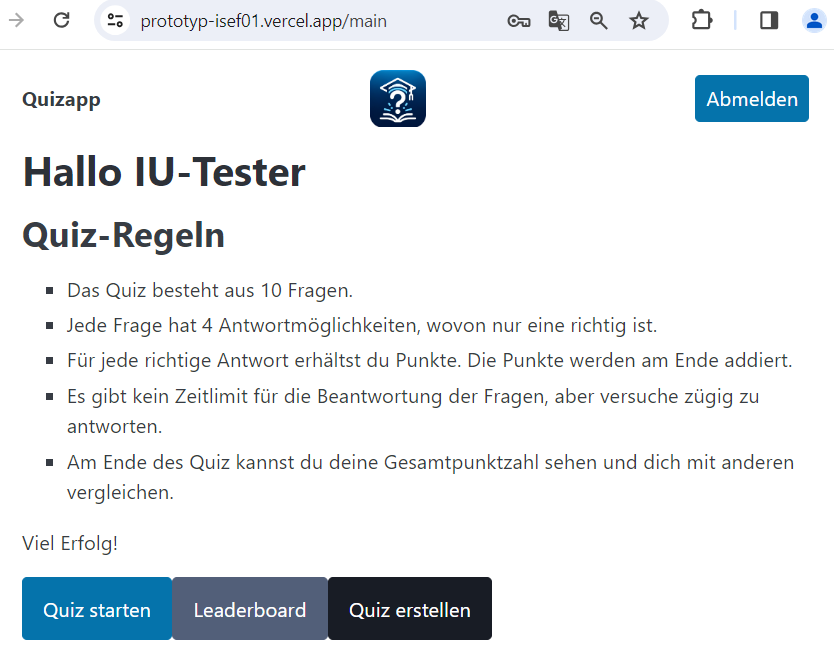
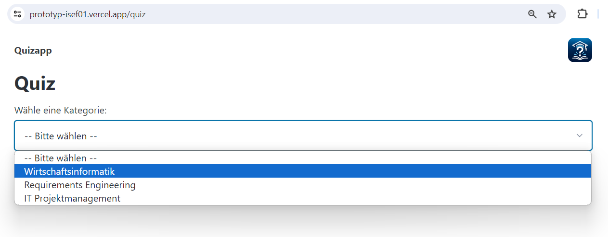

# ISEF01
# Benutzerhandbuch für die Quiz-App

Dies ist das Benutzerhandbuch für die Quiz-App. Es bietet eine Schritt-für-Schritt-Anleitung zur Verwendung der App.

Link zum testen: https://prototyp-isef01.vercel.app

## 1. Anmelden
- <strong >Info</strong> = Benutzerhandbuch
  
Um auf den QuizApp Prototypen zugreifen zu können, musst du dich einloggen. Verwende dazu die folgenden Test-Anmeldedaten:

- E-Mail: <strong style="color:#004eb5">iu.tester@iu.org</strong>
- Passwort: <strong style="color:#004eb5">test123</strong>

Nach erfolgreicher Anmeldung hast du Zugriff auf die Quiz-Funktionen.

## 2. Quiz vorbereiten
Bevor du mit dem Quiz beginnst, empfehlen wir dir, die Quiz-Regeln zu lesen.  
Die Quiz-Regeln erklären dir, wie das Quiz funktioniert und welche Regeln zu beachten sind.  
Wähle dann das gewünschte Modul/Thema aus, um deine Wissensgebiete festzulegen.

## 3. Quiz starten

Klicke auf <strong>Quiz starten</strong>, um das Quiz zu beginnen. 
Das Quiz besteht aus 10 Fragen, die du beantworten musst. 
Stelle sicher, dass du bereit bist, bevor du das Quiz startest, da es keine Unterbrechung gibt, sobald das Quiz gestartet wurde.

## 4. Quiz-Ergebnisse

Nachdem Sie alle Fragen beantwortet haben, werden Ihre Quiz-Ergebnisse zusammengefasst und angezeigt. Sie erhalten Informationen darüber, wie viele Fragen Sie richtig beantwortet haben und welche Punktzahl Sie erzielt haben. Sie haben auch die Möglichkeit, das Quiz erneut zu starten, falls Sie weitere Übung benötigen.

## 5. Leaderboard

Auf der Leaderboard-Seite können Sie Ihre Ergebnisse mit denen anderer Studenten vergleichen. Das Leaderboard zeigt die besten Quiz-Ergebnisse an und ermöglicht es Ihnen, Ihre Leistung im Vergleich zu anderen zu sehen.

