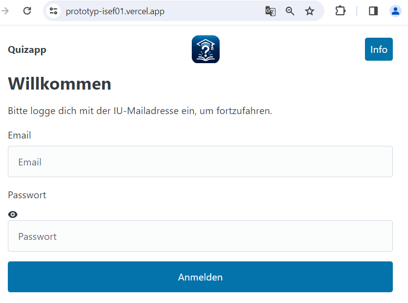

# ISEF01
# Benutzerhandbuch für die Quiz-App

Dies ist das Benutzerhandbuch für die Quiz-App. Es bietet eine Schritt-für-Schritt-Anleitung zur Verwendung der App.

Link zum testen: https://prototyp-isef01.vercel.app

## 21. Anmelden

Um auf den QuizApp Prototypen zugreifen zu können, musst du dich einloggen. Verwende dazu die folgenden Test-Anmeldedaten:

- E-Mail: <strong style="color:#004eb5">iu.tester@iu.org</strong>
- Passwort: <strong style="color:#004eb5">test123</strong>

Nach erfolgreicher Anmeldung hast du Zugriff auf die Quiz-Funktionen.

## 3. Quiz vorbereiten

Bevor Sie mit dem Quiz beginnen, sollten Sie die Quiz-Regeln lesen und ein Modul oder Thema auswählen, an dem Sie interessiert sind. Die Quiz-Regeln erklären Ihnen, wie das Quiz funktioniert und welche Regeln zu beachten sind. Wählen Sie dann das gewünschte Modul oder Thema aus, um Ihre Wissensgebiete festzulegen.

## 4. Quiz starten

Klicken Sie auf "Quiz starten", um das Quiz zu beginnen. Das Quiz besteht aus 10 Fragen, die Sie beantworten müssen. Stellen Sie sicher, dass Sie bereit sind, bevor Sie das Quiz starten, da es keine Unterbrechung gibt, sobald das Quiz gestartet wurde.

## 5. Quiz-Ergebnisse

Nachdem Sie alle Fragen beantwortet haben, werden Ihre Quiz-Ergebnisse zusammengefasst und angezeigt. Sie erhalten Informationen darüber, wie viele Fragen Sie richtig beantwortet haben und welche Punktzahl Sie erzielt haben. Sie haben auch die Möglichkeit, das Quiz erneut zu starten, falls Sie weitere Übung benötigen.

## 6. Leaderboard

Auf der Leaderboard-Seite können Sie Ihre Ergebnisse mit denen anderer Studenten vergleichen. Das Leaderboard zeigt die besten Quiz-Ergebnisse an und ermöglicht es Ihnen, Ihre Leistung im Vergleich zu anderen zu sehen.

